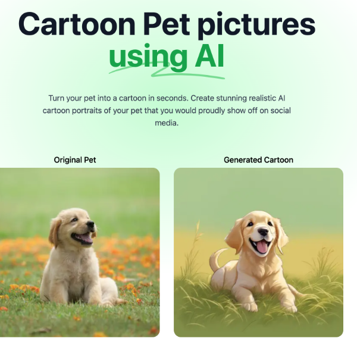

# [cartoonPet.pics](https://cartooPet.pics) - Turn your pet into a cartoon

This is an open source version of [cartoonPet.pics](https://cartoonPet.pics) (a paid SaaS product). It's a fork of roomGPT with the auth, payments, and a few additional features like hamburger menu. It's simple to clone, deploy, and play around with.

[](https://cartoonPet.pics)

## How it works

It uses a custom ML model called [cartoonify](https://replicate.com/catacolabs/cartoonify) used to generate various cartoon pictures. This application gives you the ability to upload a photo of any pet, which will send it through this ML Model using a Next.js API route, and return your generated cartoon picture. The ML Model is hosted on [Replicate](https://replicate.com) and [Bytescale](https://www.bytescale.com/) is used for image storage.

## Running Locally

### Create an account on Replicate to get an API key

1. Go to [Replicate](https://replicate.com/) to make an account.
2. Click on your profile picture in the top left corner, and click on "API Tokens".
3. Here you can find your API token. Copy it.

### Store the API keys in .env

Create a file in root directory of project with env. And store your API key in it, as shown in the .example.env file.

If you'd also like to do rate limiting, create an account on UpStash, create a Redis database, and populate the two environment variables in `.env` as well. If you don't want to do rate limiting, you don't need to make any changes.

### Clone the repository locally

```bash
git clone https://github.com/lucataco/cartoonPet
```

### Installing the dependencies.

```bash
npm install
```

### Run the application.

Then, run the application in the command line and it will be available at `http://localhost:3000`.

```bash
npm run dev
```

## License

This repo is MIT licensed.
